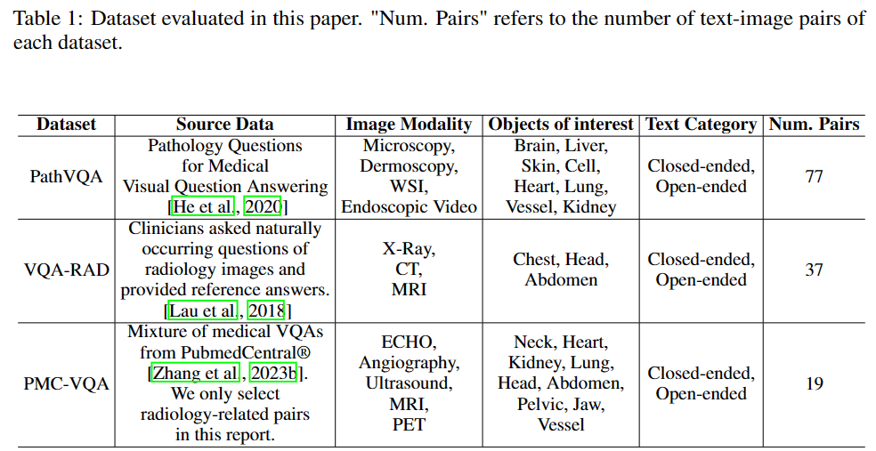
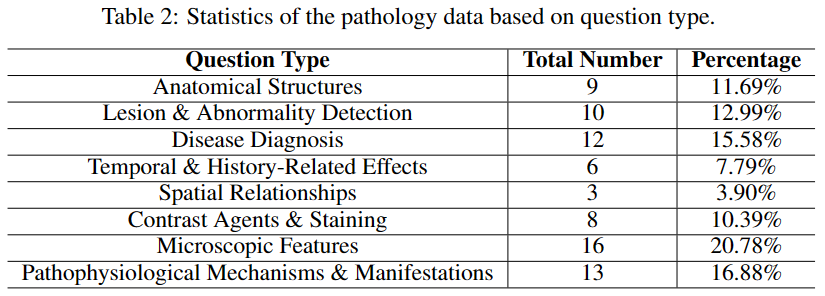
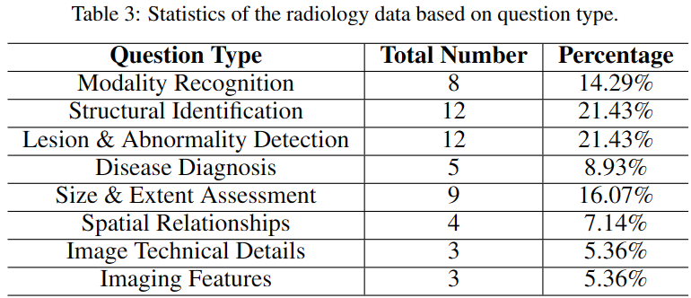

# GPT4V-Medical-Report

The official repository for "Multimodal ChatGPT for Medical Applications: an Experimental Study of GPT-4V".

In this paper, we critically evaluate the capabilities of the state-of-the-art multimodal large language model, i.e., GPT-4 with Vision (GPT-4V), on Visual Question Answering (VQA) task. Our experiments thoroughly assess GPT-4V's proficiency in answering questions paired with images using both pathology and radiology datasets from 11 modalities (e.g. Microscopy, Dermoscopy, X-ray, CT, etc.) and fifteen objects of interests (brain, liver, lung, etc.). Our datasets encompass a comprehensive range of medical inquiries, including sixteen distinct question types. 
The experiments with accuracy score conclude that the current version of GPT-4V
is not recommended for real-world diagnostics due to its unreliable and suboptimal accuracy in
responding to diagnostic medical questions. In addition,
we delineate seven unique facets of GPT-4V's behavior in medical VQA, highlighting its constraints within this complex arena.

[VQA-PATH report doc](https://docs.google.com/document/d/13TehYpCpiDIBNsxEyJFMW0Y6QADoapTC/edit?usp=drive_link&ouid=117774209307927685249&rtpof=true&sd=true), [PMC-VQA report doc](https://docs.google.com/document/d/11ebg2XlbQIXawm95Z81YuFwTK9VH5W_5/edit?usp=drive_link&ouid=117774209307927685249&rtpof=true&sd=true) and [VQA-RAD report doc](https://docs.google.com/document/d/1tFT-hUTIl862N1bX9fxiCgs9eeu7nJbu/edit?usp=drive_link&ouid=117774209307927685249&rtpof=true&sd=true) are available.

The data evaluated in this project is shown in the table below:

Question type for pathology set:

Question type for radiology set:

